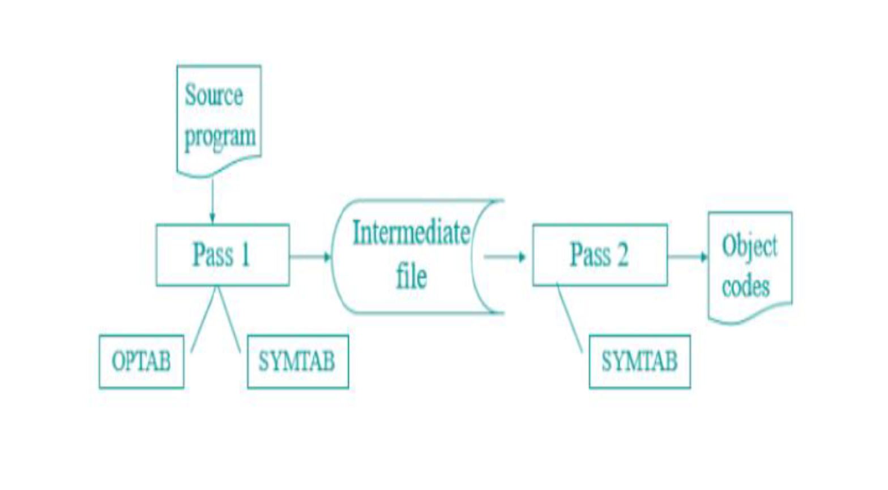
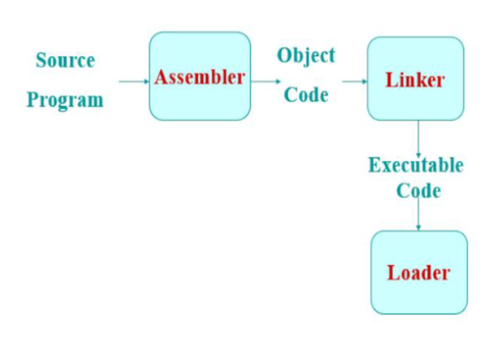

# SIC-XE-ASSEMBLER

The Simplified Instructional Computer (Extended edition) is a hypothetical computer system introduced in System Software: An Introduction to Systems Programming, by Leland Beck.
It is implemented using C++ programming language and uses Standard Template Library’s map for hash tables.
The input and output are all based on file management.
This repository aims to create an assembler for code written in SIC-XE.
The features the assembler allows for are:

-   Addressing Modes:
    - Direct Addressing Mode
    -   Indirect Addressing Mode
    -   Simple Addressing Mode
    -   Immediate Addressing Mode
    -   Relative Addressing Mode
        -   Program Counter (PC Register)
        -   Base (Base Register)
-   Extended Instruction (4bit Instruction)
-   Literals
-   Control Sections

## Design of Assembler

### Introduction

- SIC/XE stands for Simplified Instructional Computer Extra Equipment or Extra Expensive. This is particularly the advanced version of SIC,both of which are closely related and is upward compatible as well.
- Memory : It is made up of 8 bit bytes and the memory size is 1 megabyte (230 bytes). The memory size difference between SIC AND SIC/XE leads to a change in the instruction formats along with more versatile addressing modes in SIC/XE . 1 word in SIC/XE architecture is made up of 24 bits or 3 bytes . The entire addressing is based on byte addressing and word addresses are specified by their lower-order bits.
- Data Formats (SIC/XE): Characters are stored/represented as per their ASCII codes (American Standard Codes for Information Interchange) Integers are represented by Binary Numbers and floating point numbers(decimal values) using 48-bit formats as per IEEE.

### Details

Input to assembler- Assembler source program using the instruction set of SIC/XE. Output- Assembler will generate the following files as output-
- Pass 1 will generate a Symbol Table.
- Pass 1 will also generate Intermediate File for the Pass 2.
- Pass 2 will generate a listing file containing the input assembly code and address, block number, object code of each instruction.
-  Pass 2 will also generate an object program including following type of record: H, D, R, T, M and E types.
- An error file is also generated displaying the errors in the assembly program (if any).

## Assembler architecture

### Pass 1

- It updates the intermediate file and error file using the source file.
- If it is unable to find the source file or else if the intermediate file does not open, it writes the corresponding error in the error file and if the error file does not open, print it to the console.
- We declare the variables required. Then it takes the first line as input and check if it is a comment line.
- Until the lines are comments, we take them as input and print them to our intermediate file and update our line number.
- Once, the line is not a comment it checks if the opcode is `START`, if found, it updates the line number, `LOCCTR` and start address if not found, it initializes the start address and `LOCCTR` as `0`. Then, I have use two nested `while()` loops, in which the outer loop iterates till the opcode equals `END` and the inner loop iterates until the opcode is `END` or `CSECT`.
- Inside the inner loop, it checks if the line is a comment. If comment, it is printed to the intermediate file,line number is updated , and next input line is taken as input .
- If not a comment, it checks if there is a label in the line, if present it checks if label is present in the `SYMTAB`, if found we print an error saying Duplicatesymbol in the error file or else assign a name, address and other required values to the symbol and store it in the `SYMTAB`.
- Then, it checks if the opcode is present in the OPTAB, if present we find out its format and then accordingly change the `LOCCTR`.
- If not found in `OPTAB`, check it with assembler directives like `WORD`, `RESW`, `BYTE`, `RESBY` `TE`, `LTORG`, `ORG`,`BASE`,`USE`, `EQU`, `EXTREF` or `EXTDEF`.
- Accordingly, it inserts the symbols, external references and external definitions in the `SYMTAB` or the map for the control section which we created.
- For instance, for opcodes like `USE`, we insert a new `BLOCK` entry in the `BLOCK` map as defined in the `utility.cpp` file, for `LTORG` we call the handle `LTORG()` function defined in `pass1.cpp`, for `ORG`, we point out `LOCCTR` to the operand value given, for `EQU`, we check if whether the operand is an expression then we check whether the expression is valid by using the `evaluateExpression()` function, if valid then we enter the symbols in the `SYMTAB`.
- And if the opcode doesn’t match with the above given opcodes, we print an error message in the error file. Accordingly, we then update our data which is to be written in the intermediate file.
- After the ending of the while loop for control section, we update our `CSECT` TAB,the values for labels, `LOCCTR`, startaddress and length, and head on for the next control section until the outer loop ends.
- After the loop ends, we store the program length and then go on for printing the `SYMTAB`, `LITTAB` and other tables for control sections if present.
- After that the `pass2()` begins.

- **handle LT_ORG()** : It uses pass by reference. We print the literal pool present till time by taking the arguments from the `pass1()` function. We run an iterator to print all the literals present in the `LITTAB` and then update the line number. If for some literal, we did not find the address, we store the present address in the `LITTAB` and then increment the `LOCCTR` on the basis of the literal present.
- **evaluateExpression()** : It uses pass by reference. It uses a while loop to get the symbols from the expression. If the symbol is not found in the `SYMTAB`, we keep the error message in the error file. There is a variable `pairCount` which keeps the account of whether the expression is absolute or relative and if the `pairCount` gives some unexpected value, an error message is printed .
- **TABLES**: It contains all the data structures required for assembler to run. It contains the structs for `labels`, `opcode`, `literal`, `blocks`, `extdef`, `extref`, and `control sections`. The `CSECT` Tab contains `Maps` are defined for various tables with their indices as strings with the names of the labels or opcodes as required.
- **UTILITY**: It contains useful functions that will be required by the other files.
- **intstringtodecimal(stringstr)** : converts string to integer.
- **getString()** : takes in input as a character and returns a string.
- **intToStringHex()** : takes in input as int and then converts it into its hexadecimal equivalent with the string data type.
- **expandString()** : expands the input string to the given input size. It takes in the string to be expanded as a parameter and length of the output string and the character to be inserted in order to expand that string.
- **stringHexToInt()** : converts the hexadecimal string to an integer and returns the integer value.
- **stringToHexString()** : takes in a string as input and then converts the string into its hexadecimal equivalent and then returns the equivalent as a string.
- **checkWhiteSpace()** : checks if blanks are present. If present, returns true or else false.
- **checkCommentLine()** : check the comment by looking at the first character of the input string, and then accordingly returns true if comment or else false.
- **if_all_num()** : checks if all the elements of the string of the input string are number digits.
- **readFirstNonWhiteSpace()** : takes in the string and iterates until it gets the first non-space character. It is a pass-by reference function which updates the index of the input string until the blank space characters end and return void.
- **writeToFile()** : takes in the name of the file and the string to be written on to the file. Then writes the input string onto the new line of the file.
- **getRealOpcode()** : for opcodes of format 4, for example, `+JSUB` the function will see whether if the opcode contains some additional bit like ‘+’ or some other flag bits, then it returns the opcode leaving the first flag bit.
- **getFlagFormat()** : returns the flag bit if present in the input string or else it returns a null string.
- Class EvaluateString contains the functions :
- **peek()** : returns the value at the present index.
- **get()** : returns the value at the given index and then increments the index by one.  `number()` returns the value of the input string in integer format.

### Pass 2
- It takes in the intermediate file as input using the `readIntermediateFile()` function and generates the listing file and the object program. Similar to pass1, if the intermediate file is unable to open, It prints the error message in the error file. Same with the object file if unable to open. It then reads the first line of the intermediate file.
- Until the lines are comments, It takes them as input and print them to our intermediate file and update our line number.
- If the opcode is `START`, initialize out start address as the `LOCCTR` and write the line into the listing file.
- Then it checks whether the number of sections in our intermediate file was greater than one, if so, then update the program length as the length of the first control section, or else it keeps the program length unchanged. it then writes the first header record in the object program.
- Then until the opcode comes as `END` or `CSECT` if the control sections are present, it takes in the input lines from the intermediate file and then updates the listing file and then write the object program in the text record using the `textrecord()` function.
-  Then it writes the object code on the basis of the types of formats used in the instruction.
- Based on different types of opcodes such as `BYTE` , `WORD` , `BASE` , `NOBASE` , `EXTDEF` , `EXTREF` , `CSECT` , it will generate different types of object codes. For the format 3 and format 4 instruction formats, it will use the `createObjectCodeFormat34()` function in the `pass2.cpp`.
- For writing the end record, it uses the `writeEndRecord()` function.
- If control sections are present, it will use the `writeRRecord()` and `writeDRecord()` to write
the external references and the external definitions.
- For the instructions with immediate addressing, it will write the modification record.
- When the inner loop for the control section finishes, it will again loop to print the next section until the last opcode for `END` occurs.
- **readTillTab()** :takes in the string as input and reads the string until tab(backslash t) occurs.
- **readIntermediateFile()** : takes in line number, `LOCCTR`, `opcode`, `operand`, `label` and `input` `output` files. If the line is comment returns true and takes in the next input line. Then using the `readTillTab()` function, it reads the `label`, `opcode`, `operand` and the `comment`. Based on the different types of opcodes, it will count in the necessary conditions to take in the operand.
- **createObjectCodeFormat34()** : When it gets format for the opcode as 3 or 4, we call this function. It checks the various situations in which the opcode can be and then taking into consideration the operand and the number of half bytes calculates the object code for the instruction. It also modifies the modification record when there is a need to do so.
- **writeDRecord()**: It writes in the D record after the H record is written if the control sections are present.
- **writeRRecord()**: It writes in the R record for the control section.
- **writeEndRecord()**: It will write the end record for the program. After the execution of the `pass1.cpp`, it will print the Tables like `SYMTAB`, `LITTAB`, etc., in a separate file and then execute the `pass2.cpp`.

### Data Structures used in Implementation
- Map
- Struct Details :
- Maps are associative containers that store elements in a mapped fashion.
- Each element has a key value and a mapped value. Structure(struct) is a collection of variables
of different data types under a single name.
- It is similar to a class in that, both holds a collection of data of different data types.
- Map is used to store the `SYMBOL TABLE`, `OPCODE TABLE`, `REGISTER TABLE`, `LITERAL TABLE`, `BLOCK TABLE`, `CONTROL SECTIONS`.
- Each map of these tables contains a key in the form of string(data type) which represent an element of the table and the mapped value is a struct which stores the information of that element.
Structures of each are as follows :
- **SYMTAB** : The struct contains information on labels like name, address, block number, a character representing whether the label exits in the symbol table or not, an integer representing whether label is relative or not.
- **OPTAB** : The struct contains information of opcode like name, format, a character representing whether the opcode is valid or not.
- **LITTAB** : The struct contains information of literals like its value, address, block number, a character representing whether the literal exits in the literal table or not.
- **REGTAB** : The struct contains information of registers like its numeric equivalent, a character representing whether the registers exits or not.
- **BLOCKS** : The struct contains information of blocks like its name, start address, block number, location counter value for end address of block, a character representing whether the block exits or not.
- **CSECT** : The struct contains information of different control section like its name, start address,section number,length, location counter value for end address of section. It also contains two maps for `extref` and `extdef` of particular section.

The figure below shows how source code is handled by machine


The figure below shows a more detailed view of the same


## Instructions

### Compiling the binary

Run the following command in terminal to run the code
```
git clone https://github.com/SK1PPR/SIC-XE-ASSEMBLER.git

g++ pass2.cpp
```

### Running the code
The above command will create an `a.out` or `pass2.exe` depending on the operating system
Create an `input.txt` that contains the `SIC-XE` code.

```
./a.out input.txt
```

The program will generate the following files
```
object_input.txt
error_input.txt
listing_input.txt
intermediate_input.txt
```
## Sample Input

```
COPY    START    0
        EXTDEF   BUFFER,BUFEND,LENGTH
        EXTREF   RDREC,WRREC
FIRST   STL      RETADR
CLOOP  +JSUB     RDREC
        LDA      LENGTH
        COMP    #0
        JEQ      ENDFIL
       +JSUB     WRREC
        J        CLOOP
ENDFIL  LDA     =C'EOF'
        STA      BUFFER
        LDA     #3
        STA      LENGTH
       +JSUB     WRREC
        J       @RETADR
RETADR  RESW     1
LENGTH  RESW     1
        LTORG
BUFFER  RESB     4096
BUFEND  EQU      *
MAXLEN  EQU      BUFEND-BUFFER
RDREC   CSECT
.
.       SUBROUTINE TO READ RECORD INTO BUFFER
.
        EXTREF   BUFFER,LENGTH,BUFFEND
        CLEAR    X
        CLEAR    A
        CLEAR    S
        LDT      MAXLEN
RLOOP   TD       INPUT
        JEQ      RLOOP
        RD       INPUT
        COMPR    A,S
        JEQ      EXIT
       +STCH     BUFFER,X
        TIXR     T
        JLT      RLOOP
EXIT   +STX      LENGTH
        RSUB
INPUT   BYTE     X'F1'
MAXLEN  WORD     BUFEND-BUFFER
.....
WRREC   CSECT
.
.       SUBROUTINE TO WRITE RECORD FROM BUFFER
.
        EXTREF    LENGTH,BUFFER
        CLEAR     X
       +LDT       LENGTH
WLOOP   TD       =X'05'
        JEQ       WLOOP
       +LDCH      BUFFER,X
        WD       =X'05'
        TIXR      T
        JLT       WLOOP
        RSUB
        END       FIRST
```

## Sample Output

- Table file

```
**********************************SYMBOL TABLE*****************************

:-	name:undefined	|address:0	|relative:00000 
0:-	name:	|address:0	|relative:00000 
COUNT:-	name:COUNT	|address:0001D	|relative:00001 
FIRST:-	name:FIRST	|address:00000	|relative:00001 
LOOP:-	name:LOOP	|address:0000A	|relative:00001 
TABLE:-	name:TABLE	|address:00020	|relative:00001 
TABLE2:-	name:TABLE2	|address:01790	|relative:00001 
TOTAL:-	name:TOTAL	|address:02F00	|relative:00001 

**********************************LITERAL TABLE*****************************


**********************************EXTREF TABLE*****************************


**********************************EXTDEF TABLE*****************************

```

- Object file

```
H^SUM   ^000000^002F03
T^000000^1D^050000010000691017901BA0131BC0002F200A3B2FF40F102F004F0000
M^000007^05
M^000017^05
E^000000

```

- Listing file

```
Line	Address	Label	OPCODE	OPERAND	ObjectCode	Comment
5	00000	0	SUM	START	0		
10	00000	0	FIRST	LDX	#0	050000	
15	00003	0		LDA	#0	010000	
20	00006	0		+LDB	#TABLE2	69101790	
25	0000A	0		BASE	TABLE2		
30	0000A	0	LOOP	ADD	TABLE,X	1BA013	
35	0000D	0		ADD	TABLE2,X	1BC000	
40	00010	0		TIX	COUNT	2F200A	
45	00013	0		JLT	LOOP	3B2FF4	
50	00016	0		+STA	TOTAL	0F102F00	
55	0001A	0		RSUB	 	4F0000	
60	0001D	0	COUNT	RESW	1		
65	00020	0	TABLE	RESW	2000		
70	01790	0	TABLE2	RESW	2000		
75	02F00	0	TOTAL	RESW	1		
80	02F03	 		END	FIRST		

```

- Intermediate File

```
Line	Address	Label	OPCODE	OPERAND	Comment
5	00000	0	SUM	START	0	
10	00000	0	FIRST	LDX	#0	
15	00003	0		LDA	#0	
20	00006	0		+LDB	#TABLE2	
25	0000A	0		BASE	TABLE2	
30	0000A	0	LOOP	ADD	TABLE,X	
35	0000D	0		ADD	TABLE2,X	
40	00010	0		TIX	COUNT	
45	00013	0		JLT	LOOP	
50	00016	0		+STA	TOTAL	
55	0001A	0		RSUB	 	
60	0001D	0	COUNT	RESW	1	
65	00020	0	TABLE	RESW	2000	
70	01790	0	TABLE2	RESW	2000	
75	02F00	0	TOTAL	RESW	1	
80	02F03	 		END	FIRST	
```

- Error file

```
************PASS1************


************PASS2************

```